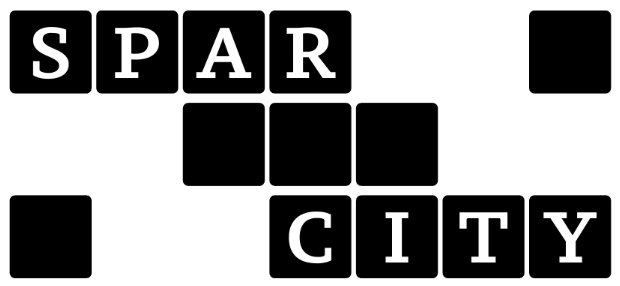
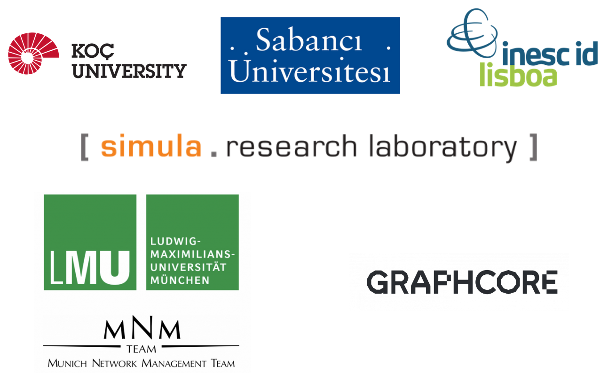

# SparCity

The [SparCity project](http://sparcity.eu/ "The SparCity project web-page") aims at creating a supercomputing framework that will provide efficient algorithms and coherent tools specifically designed for maximising the performance and energy efficiency of sparse computations on emerging HPC systems, while also opening up new usage areas for sparse computations in data analytics and deep learning.

Overall, SparCity is a forward-looking project with a significant contribution to building Europe’s strengths in the application of HPC and related software tools, in the adoption of low-energy processing technologies, and in the development of advanced software and services for its citizens.

## Aim

The SparCity project aims at creating a supercomputing framework that will provide efficient algorithms and coherent tools specifically designed for maximising the performance and energy efficiency of sparse computations on emerging HPC systems, while also opening up new usage areas for sparse computations in data analytics and deep learning.

## Objectives

1. Develop a comprehensive application and data characterization mechanism and orchestrate an advanced and synergistic software optimization process, based on the state-of-the-art analytical and machine-learning-based performance and energy models;

2. Develop advanced node-level static and dynamic code optimizations designed for massive and heterogeneous parallel architectures with complex memory hierarchy and exploit mixed-precision opportunities for sparse computation;

3. Devise topology-aware partitioning algorithms and optimizations to minimize the communication overhead and boost the efficiency of system-level parallelism;

4. Create digital SuperTwins of supercomputers to evaluate and simulate what-if hardware scenarios and to gather real-time performance and energy intel from node- and system-level components for application optimization on the current and future hardware;

5. Demonstrate the effectiveness and usability of the SparCity framework by enhancing the computing scale and energy efficiency of four challenging real-life applications, namely, computational cardiology, social network analysis, bioinformatics and computer vision applications;

6. Deliver a robust, well-supported and documented SparCity framework into the hands of computational scientists, data analysts, and deep learning end-users from industry and academia.

## Consortium

